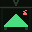
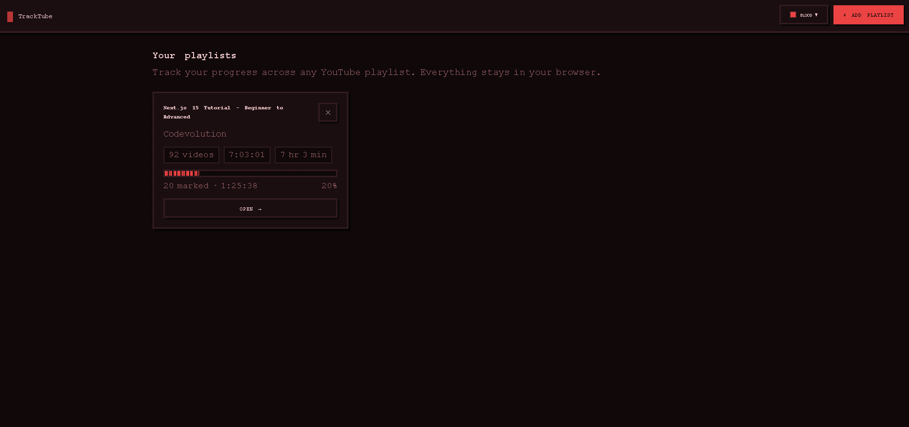
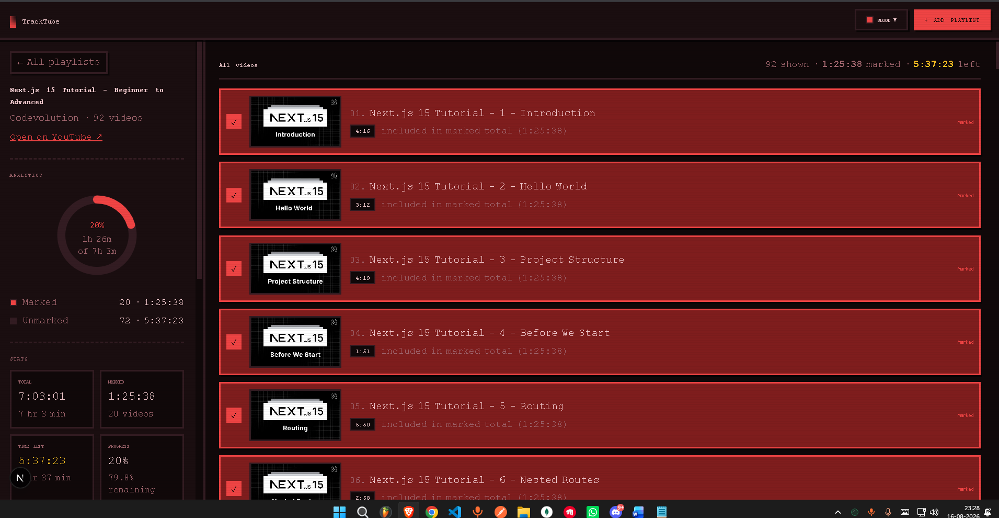

# TrackTube

<p align="center">
  
</p>

Track your progress across any YouTube playlist — with a retro pixel-art UI.

Paste any YouTube playlist link, TrackTube fetches all video metadata via **yt-dlp**, and lets you mark videos as watched while live-counting your marked time, remaining time and progress. Log in with a username to keep everything in the **cloud (Supabase)** — or use it account-free with your browser's **localStorage**.

## Screenshots

| Dashboard | Playlist tracker |
| --- | --- |
|  |  |

## Features

- ➕ **Add any YouTube playlist** — paste a link, watch a live progress bar while metadata streams in
- 🔐 **Accounts** — register with a username; passwords are hashed with **bcrypt**, sessions are basic **JWT** tokens
- 🗄️ **Cloud storage (Supabase)** — logged-in users get their playlists, videos and progress in Postgres with row-level security; logged-out users fall back to localStorage
- 📊 **Analytics sidebar** — animated donut chart (marked vs remaining), total/marked/time-left stats, longest-videos breakdown
- ⏱️ **Live time totals** — select videos and the marked time & time left update instantly (`H:MM:SS` + humanized)
- 🔍 **Filters** — search by title, tabs for All / Marked / Not marked
- 🛡️ **Rate limiting** — 1 playlist fetch per hour per IP (file-persisted, toggleable via env)
- 🎨 **10 dark pixel themes** — CRT Green, Sunset, Ocean, Blood, Forest, Purple Haze, Mono, Candy, Ember, Night Blue
- 🕹️ **Pixel-art aesthetic** — Press Start 2P + VT323 fonts, scanlines, hard pixel shadows
- 📱 **Responsive** — sidebar stacks on top for mobile, cards adapt down to small screens
- ⚠️ **Confirm popups** for destructive actions (Mark all, Clear all, Reset, Delete playlist)

## Tech Stack

- **Next.js 15** (App Router) + React 19
- **yt-dlp** — server-side playlist metadata extraction (streamed, no temp files)
- **Supabase** — Postgres database for registered users (`users`, `playlists`, `playlist_videos`, `progress`)
- **bcryptjs + jsonwebtoken** — password hashing and JWT sessions
- **localStorage** — anonymous/local-first fallback

## Quick Start

```bash
npm install
cp .env.example .env.local   # set RATE_LIMITING=true/false
npm run dev                  # http://localhost:3000
```

Anonymous mode works immediately (localStorage). For accounts + cloud storage:

1. Create a project at [supabase.com](https://supabase.com)
2. Open **SQL Editor → New query**, paste the entire contents of `supabase_query.db`, click **Run**
3. Fill `SUPABASE_URL`, `SUPABASE_ANON_KEY`, `SUPABASE_SERVICE_ROLE_KEY` and `JWT_SECRET` in `.env.local`

Requires [yt-dlp](https://github.com/yt-dlp/yt-dlp) on the host machine (`yt-dlp --version`).

## Documentation

| Doc | Contents |
| --- | --- |
| [docs/features.md](docs/features.md) | Feature-by-feature overview |
| [docs/technical.md](docs/technical.md) | Architecture, data flow, storage schema, API |
| [docs/hld.md](docs/hld.md) | High-Level Design (mermaid diagrams) |
| [docs/lld.md](docs/lld.md) | Low-Level Design (modules, functions) |
| [docs/problems-fixed.md](docs/problems-fixed.md) | Every bug encountered & how it was fixed |

## License

MIT