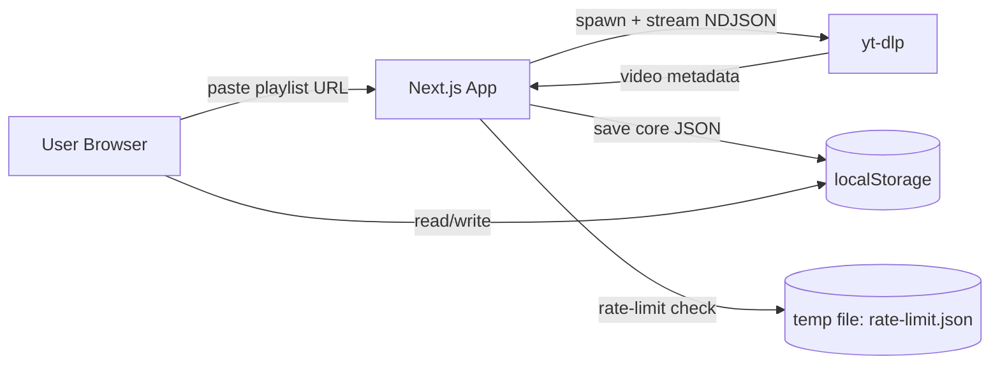
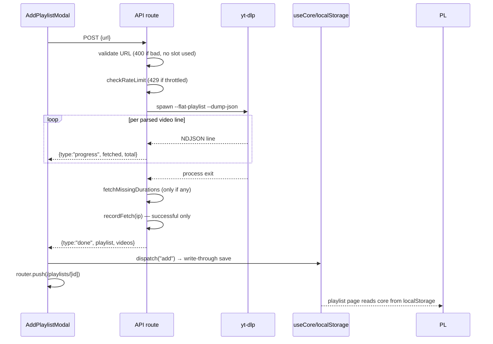
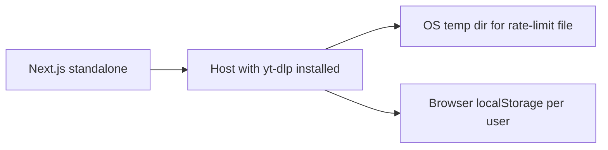

# High-Level Design (HLD)

## System context



Everything is **local-first**. The only external dependency is yt-dlp (server-side), and the
only persistence is the browser's localStorage. No database, no third-party APIs.

## Component view

```mermaid
flowchart TD
    subgraph Client
        NAV[NavBar] --> TP[ThemePicker]
        NAV --> AP[AddPlaylistModal]
        HOME[Dashboard page /] --> UC[useCore hook]
        PL[Playlist page /playlists/[id]] --> UC
        UC --> LS[(localStorage)]
        PL --> SB[Sidebar]
        PL --> VL[VideoList]
        SB --> DN[Donut]
        SB --> MB[MiniBar]
        AP -->|"POST /api/playlists"| API
    end

    subgraph Server
        API[Route Handler] --> RL[rateLimit]
        API --> FETCH[fetchPlaylist]
        FETCH --> Y[yt-dlp child process]
    end
```

## Data flow — fetch lifecycle



## Deployment shape



## Security & limits

- **Rate limiting**: 1 successful fetch/hour/IP, persisted to disk (survives restarts), env-toggleable (`RATE_LIMITING`).
- **Input validation**: server-side URL validation before any work; invalid input costs no rate-limit slot.
- **No secrets**: no API keys; yt-dlp runs with `--no-call-home`.
- **Client safety**: only YouTube video IDs are used in thumbnail URLs (built server-side); playlist data is inert JSON.