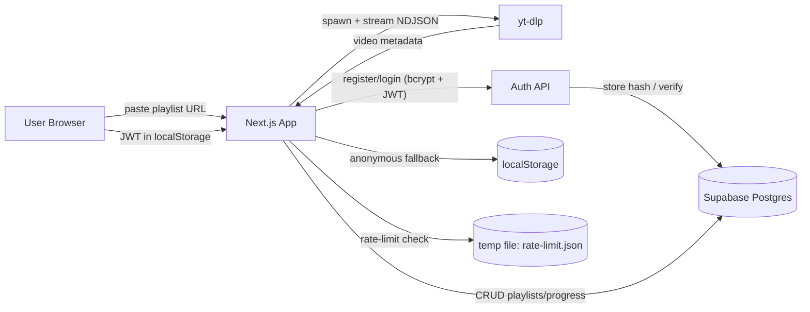
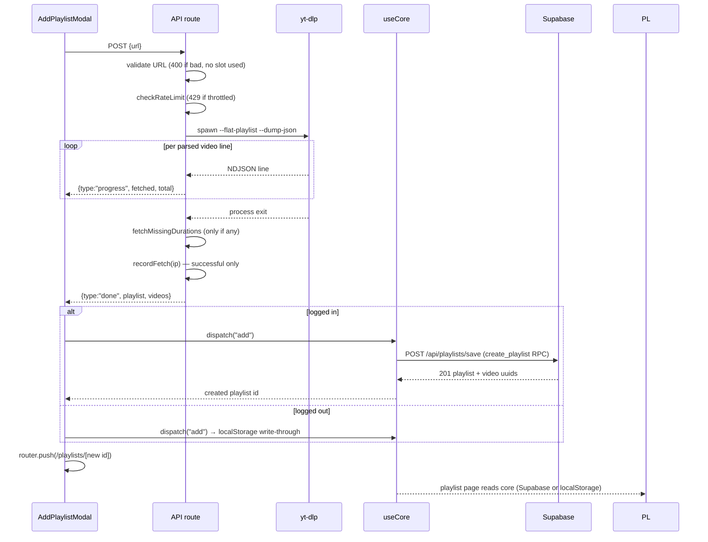
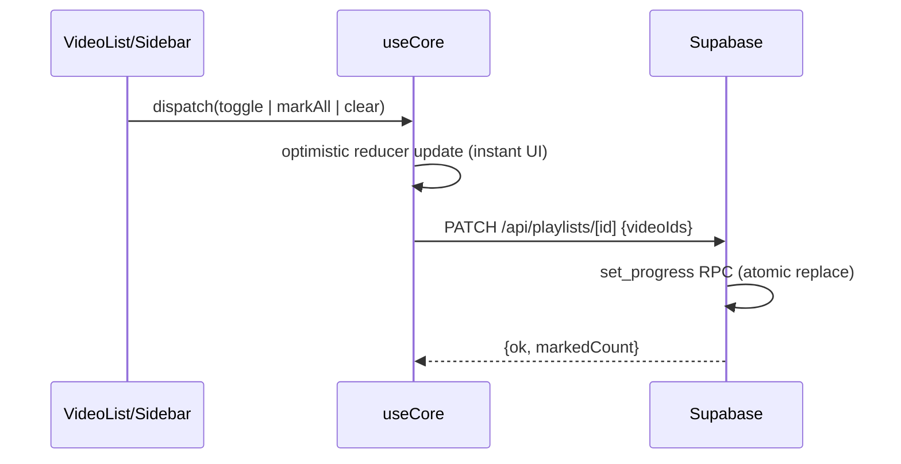
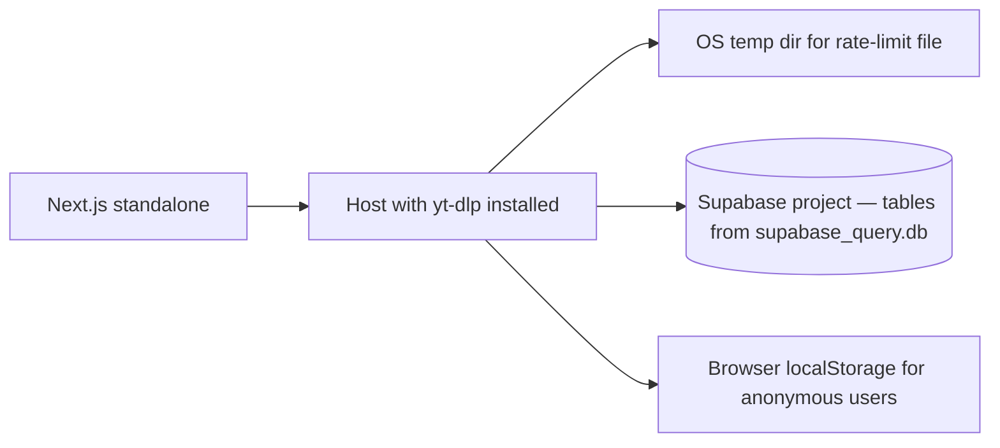

# High-Level Design (HLD)

## System context



Two storage modes:

- **Logged in**: playlists, videos and progress live in **Supabase** (user-scoped rows, RLS locked down; server talks via the service-role key). Auth is self-made: bcrypt-hashed passwords + JWT.
- **Logged out**: everything stays in the browser's **localStorage** (original local-first behavior).

## Component view

```mermaid
flowchart TD
    subgraph Client
        NAV[NavBar] --> TP[ThemePicker]
        NAV --> AP[AddPlaylistModal]
        HOME[Dashboard page /] --> UC[useCore hook]
        PL[Playlist page /playlists/[id]] --> UC
        UC -->|"token + CRUD"| API
        UC -->|"anonymous fallback"| LS[(localStorage)]
        NAV -->|"login/register/logout"| AUTH[useAuth hook]
        REG[Register page] --> AUTH
        LOG[Login page] --> AUTH
        PL --> SB[Sidebar]
        PL --> VL[VideoList]
        SB --> DN[Donut]
        SB --> MB[MiniBar]
        AP -->|"POST /api/playlists (stream)"| API
    end

    subgraph Server
        API[Route Handlers] --> RL[rateLimit]
        API --> FETCH[fetchPlaylist]
        FETCH --> Y[yt-dlp child process]
        API --> AUTHAPI[Auth + CRUD handlers]
        AUTHAPI --> SUP[lib/supabase service-role client]
        SUP --> DB[(Supabase Postgres)]
    end
```

## Data flow — fetch lifecycle



## Progress sync (logged in)



Every toggle replaces the full marked set, so the DB always ends up consistent with the last local state (last-write-wins). All CRUD actions require `Authorization: Bearer <jwt>`.

## Deployment shape



## Security & limits

- **Passwords**: never stored — bcrypt (10 rounds) hashes only.
- **Sessions**: JWT signed with `JWT_SECRET` (env, never committed); `/api/auth/me` validates on restore; expired/invalid tokens → `401` → auto logout.
- **Authorization**: every CRUD route re-derives the user from the token server-side and scopes all queries by `user_id`.
- **Database**: RLS enabled on all four tables with no public policies — only the server's service-role key can touch the data.
- **Rate limiting**: 1 successful fetch/hour/IP, persisted to disk (survives restarts), env-toggleable (`RATE_LIMITING`).
- **Input validation**: server-side URL validation before any work; invalid input costs no rate-limit slot.
- **Client safety**: only YouTube video IDs are used in thumbnail URLs; playlist data is inert JSON.